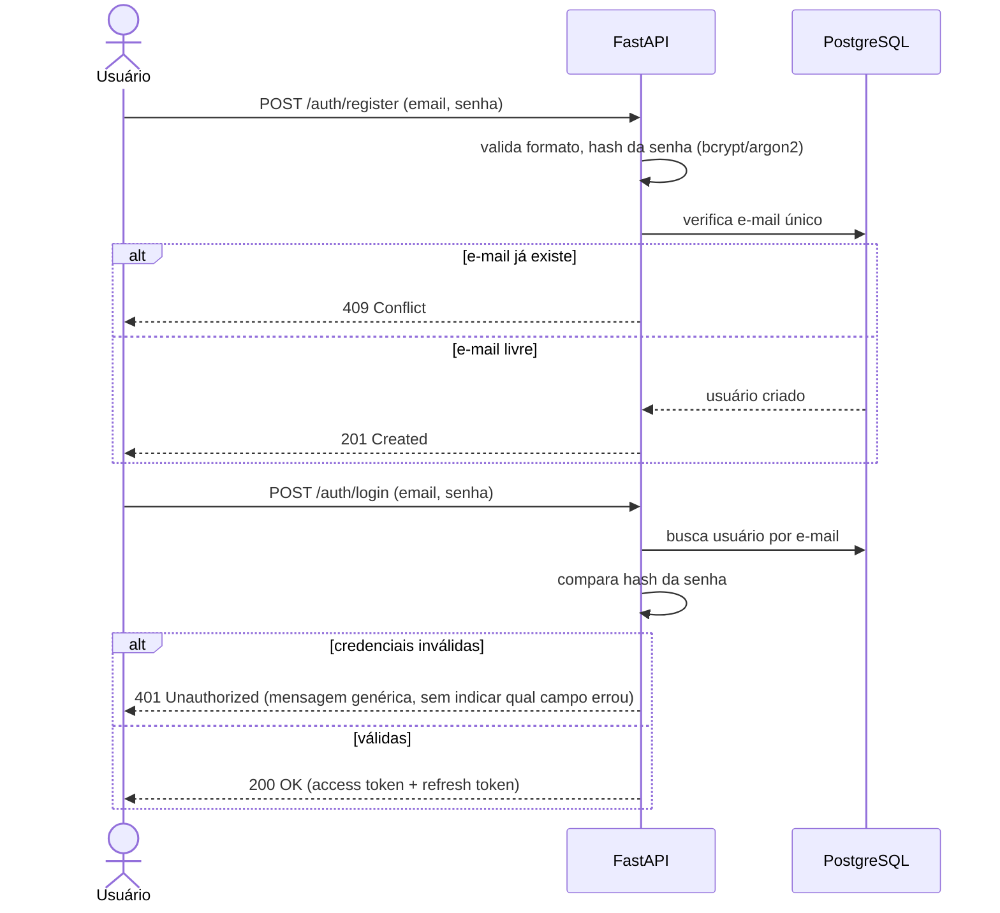
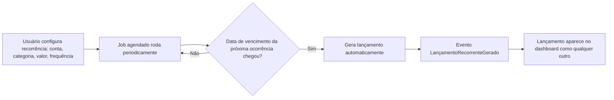
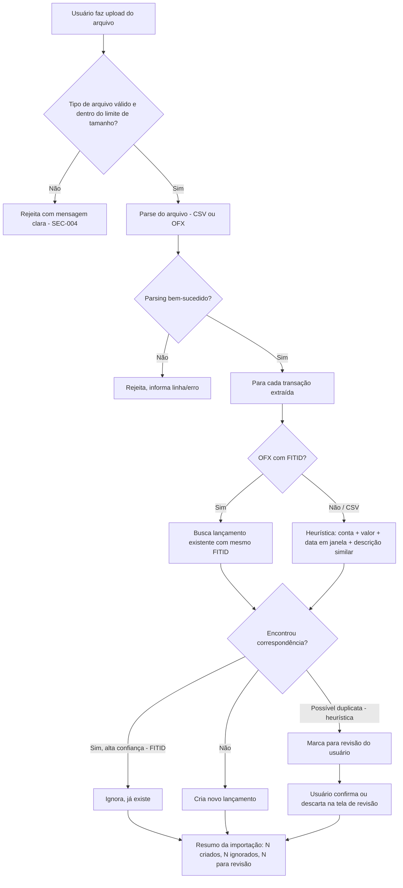

# CashTrail — Casos de Uso e Fluxos (FASE 4)

## Decisão tomada nesta fase: critério de deduplicação na importação (resolve RB-006)

**DECISÃO:** Como identificar que um lançamento importado já existe (evitando duplicar), tanto contra lançamentos manuais quanto contra lançamentos gerados por recorrência (RF-012/RB-006)?

**ALTERNATIVAS:**
1. Correspondência exata (conta + data + valor).
2. Correspondência por janela de data (conta + valor + data ± N dias) — cobre o caso comum de o banco compensar em D+1.
3. Usar o campo `FITID` do OFX (identificador único de transação definido pelo próprio banco no padrão OFX) quando disponível; heurística (2) como fallback para CSV, que não tem identificador padronizado.

**EVIDÊNCIAS:** o padrão OFX inclui `FITID` justamente para idempotência de importação — é a fonte mais confiável quando existe. CSV não tem padrão de indústria, exige heurística. Firefly III (pesquisado na FASE 2) usa um sistema de regras configuráveis em vez de um critério único fixo, o que sugere que não existe solução perfeita — o produto deve assumir isso.

**TRADE-OFFS:** heurística de CSV pode gerar falso positivo (duas compras legítimas de mesmo valor no mesmo dia) ou falso negativo (banco muda a data em 1-2 dias). Bloquear automaticamente é arriscado — perder um lançamento real é pior que exigir uma confirmação humana ocasional.

**RECOMENDAÇÃO:**
- OFX: usar `FITID` (por conta) como chave de deduplicação — confiável.
- CSV: heurística (conta + valor + data dentro de uma janela + descrição semelhante) sinaliza "possível duplicata" para **revisão do usuário na tela de importação**, nunca decide sozinho de forma silenciosa.

**CONFIANÇA:** Alta para OFX, Média para CSV (heurística sujeita a ajuste depois de ver dados reais).

**O QUE PRECISA SER VALIDADO:** o formato real do extrato que você vai importar (qual banco, como o CSV é exportado) — hoje é **DESCONHECIDO**. Isso deveria ser confirmado antes de implementar o parser (candidato a SPIKE/POC pontual na hora da Fase 3 de implementação, não agora).

---

## Fluxo 1 — Registro e Login

- **Ator:** Usuário não autenticado.
- **Regras aplicadas:** SEC-001, SEC-002, SEC-006 (rate limiting no login), RF-001/RF-002.
- **Exceções:** e-mail duplicado, senha incorreta, muitas tentativas (rate limit).

---

## Fluxo 2 — Lançamento manual (receita/despesa)

- **Pré-condição:** usuário autenticado; ao menos 1 conta e 1 categoria cadastradas.
- **Entrada:** conta, categoria, tipo (receita/despesa), valor, data, descrição, (opcional) meta vinculada.
- **Processamento:** valida que conta e categoria pertencem ao usuário autenticado (RNF-001/SEC-002); persiste lançamento; se houver orçamento ativo para a categoria/mês, recalcula % consumido (RF-007); se vinculado a uma meta, recalcula progresso da meta (RB-003).
- **Persistência:** tabela de lançamentos (ver `08-data-model.md`, a produzir na FASE 10).
- **Saída:** lançamento criado; dashboard e orçamento refletem o novo valor imediatamente.
- **Pós-condição:** saldo da conta e progresso de orçamento/meta atualizados.
- **Exceções:** conta/categoria de outro usuário (403), valor inválido (ex: negativo em campo que exige positivo — regra de sinal a decidir: usar campo "tipo" explícito em vez de valor negativo, para evitar ambiguidade).

---

## Fluxo 3 — Orçamento por categoria/mês

- **Ator:** usuário.
- **Pré-condição:** categoria existente.
- **Regra (RB-002):** não pode haver 2 orçamentos para a mesma categoria+mês/ano.
- **Processamento:** ao criar/editar orçamento, sistema soma lançamentos já existentes da categoria no mês para calcular % consumido inicial.
- **Evento:** `OrçamentoEstourado` disparado quando soma de lançamentos > limite definido (consumido por RF-008, mecanismo de alerta ainda pendente em `05-mvp.md`).
- **Exceção:** tentativa de criar orçamento duplicado (RB-002) → 409 Conflict.

---

## Fluxo 4 — Meta de economia

- **Ator:** usuário.
- **Processamento:** meta tem valor-alvo e prazo; lançamentos podem ser vinculados a ela (RB-003); progresso = soma dos lançamentos vinculados.
- **Evento:** `MetaAtingida` quando soma vinculada ≥ valor-alvo.
- **Ponto de decisão em aberto:** um lançamento pode ser vinculado a **uma única** meta, ou a múltiplas? **Recomendação:** uma única meta por lançamento, para manter o cálculo de progresso simples e sem dupla contagem. Considero isso resolvido salvo objeção sua.

---

## Fluxo 5 — Lançamento recorrente

- **Regra (RB-004):** continua gerando até ser cancelado/editado.
- **Risco identificado:** se o usuário também importar um extrato que contenha essa mesma cobrança, corre-se o risco de duplicidade — é exatamente o cenário que o Fluxo 6 (importação) precisa tratar cruzando com lançamentos já gerados por recorrência, não só com lançamentos manuais.

---

## Fluxo 6 — Importação de extrato (CSV/OFX) com conciliação

- **Regras aplicadas:** RF-011, RF-012, RB-006 (decisão acima), SEC-004.
- **Exceções:** arquivo corrompido, encoding inválido, formato de data não reconhecido, arquivo maior que o limite.
- **Pós-condição:** usuário vê resumo claro do que foi importado/ignorado/pendente de revisão — nunca uma importação "silenciosa" sem relatório.

---

**STATUS:** Pronto para avançar, com uma decisão implícita tomada por recomendação (vínculo lançamento↔meta 1:1) — considerar confirmada salvo objeção.

**PENDÊNCIA real (não bloqueante agora, mas leve nota):** formato real do extrato bancário que você vai importar é desconhecido — candidato a validar com um arquivo de exemplo seu quando chegarmos na implementação dessa fatia.

Seguimos para a **FASE 5 — Pesquisa de APIs e Integrações** (focada em Azure: banco gerenciado, storage de arquivo, hospedagem do backend/frontend)?
