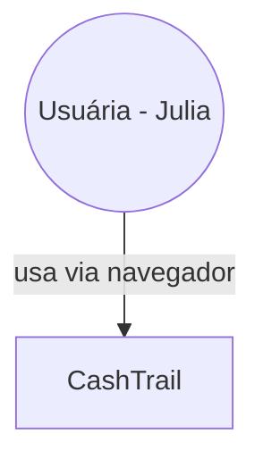
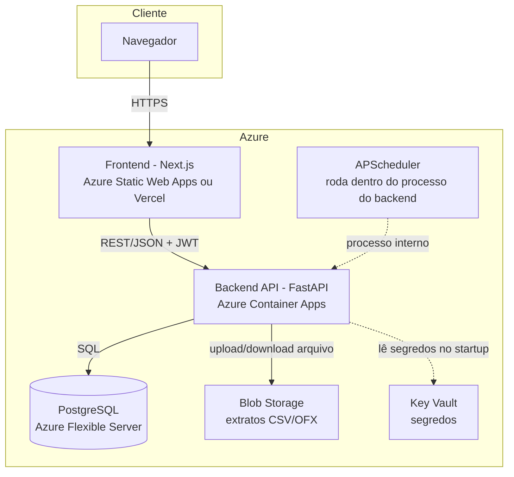
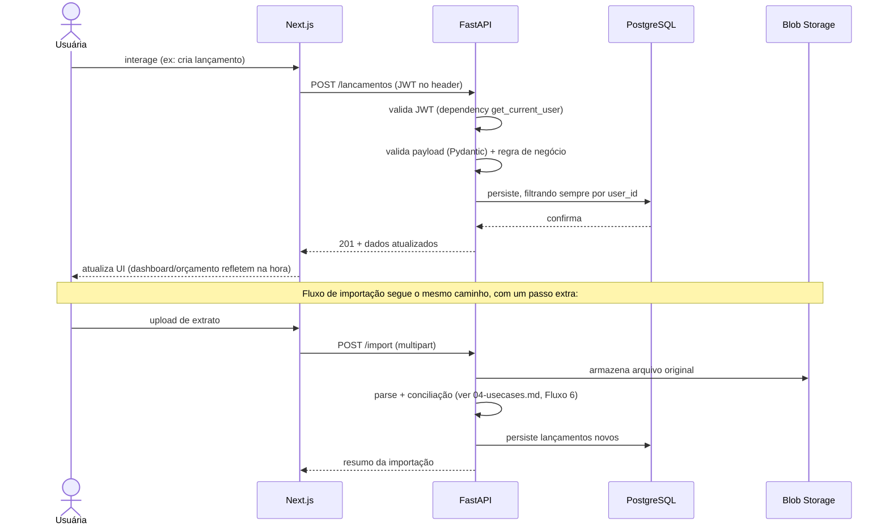

# CashTrail — Arquitetura (FASE 8)

## Context Diagram

Não há sistemas externos reais no MVP (integração bancária real está fora de escopo — ver `02-market-research.md` e `03-requirements.md` INT-002). O único ator externo é a própria usuária.

## Container Diagram (C4 nível 2)

**Nota de design**: o APScheduler não é um serviço separado — roda como parte do mesmo processo do backend (thread/job interno), coerente com a decisão da FASE 7 de não introduzir Celery/Redis sem necessidade concreta.

## Limites de responsabilidade

| Pergunta | Resposta |
|---|---|
| **Quem é responsável por quê?** | Frontend: apresentação e validação de formulário *espelhada* (nunca definitiva). Backend: toda regra de negócio, validação definitiva, autenticação/autorização, persistência, orquestração do job de recorrência, parsing de importação. Banco: integridade referencial via constraints/FKs — última linha de defesa, não só a aplicação. Blob Storage/Key Vault: armazenamento bruto, sem lógica de negócio nenhuma. |
| **Quem conhece quem?** | Frontend só conhece o contrato público da API (OpenAPI/Swagger) — nunca acessa banco, storage ou Key Vault diretamente. Backend conhece Postgres, Blob Storage e Key Vault. Nenhum serviço externo tem callback/webhook para o backend no MVP (sem Open Finance = sem essa superfície de acoplamento). |
| **Onde está a regra de negócio?** | Exclusivamente no backend (services/casos de uso). O frontend nunca recalcula orçamento, progresso de meta ou detecção de duplicidade — só exibe o que a API retorna. Isso evita a inconsistência clássica de "regra duplicada" divergindo entre front e back. |
| **Onde ocorre a persistência?** | PostgreSQL, acessado exclusivamente pelo backend via SQLAlchemy. Nenhum outro componente acessa o banco diretamente. |
| **Onde ocorre integração externa?** | Hoje, nenhuma (upload de arquivo é do próprio usuário, não integração de terceiro). Blob Storage é o único "externo" tecnicamente, mas é infraestrutura, não integração de negócio. |
| **Onde devemos impedir acoplamento?** | (1) Upload de extrato passa pelo backend, que valida e decide onde armazenar — não expor SAS token de Blob Storage direto ao frontend no MVP (reduziria superfície de ataque, mas adicionaria complexidade desnecessária para o volume de arquivo esperado). (2) Autenticação/autorização centralizada numa única dependency reutilizável do FastAPI (`get_current_user`), nunca checagem ad hoc espalhada por rota — evita o bug clássico de "esqueceram de checar auth nesse endpoint". |

## Fluxo de dados (visão geral)

## Fluxo de autenticação
Já detalhado em `04-usecases.md` (Fluxo 1). Reforço arquitetural: o access token JWT é validado em toda rota protegida via uma única dependency compartilhada do FastAPI — não há verificação de token duplicada/reimplementada em múltiplos lugares.

## Ambientes

- **Desenvolvimento local**: Docker Compose com Postgres local — sem depender da Azure para codar/testar no dia a dia (evita gastar crédito à toa).
- **CI (GitHub Actions)**: sobe Postgres efêmero via Testcontainers para testes de integração reais a cada push/PR — sem custo (repo público).
- **Produção (Azure)**: único ambiente de nuvem. **Decisão deliberada de não ter ambiente de staging separado** — para um projeto de uma única desenvolvedora/usuária, staging duplicaria custo (outro banco, outro Container App) sem benefício proporcional; o CI com testes de integração reais já cumpre o papel de gate de qualidade antes do deploy.

## Observabilidade

- Mínimo necessário (OPS-004 de `03-requirements.md`): logs estruturados no backend (nível INFO para eventos de domínio, ERROR para falhas).
- **Decisão explicitamente adiada**: ferramenta de observabilidade mais completa (ex: Azure Application Insights) fica para a FASE 4 do roadmap (Hardening), não é necessária para desenhar a arquitetura agora — evita comprometer uma escolha de ferramenta sem ter ainda um problema real de debug em produção que a justifique.

## Segurança (visão arquitetural — detalhe completo na FASE 11)

- Autenticação centralizada (dependency única), autorização por `user_id` em toda query, segredos no Key Vault (nunca no código-fonte ou em variável de ambiente commitada), upload de arquivo validado antes de tocar no parser (SEC-004).

---

**STATUS**: Pronto para avançar.

Seguimos para a **FASE 9 — Vertical Slice Architecture** (organização do repositório por funcionalidade, não por camada)?
