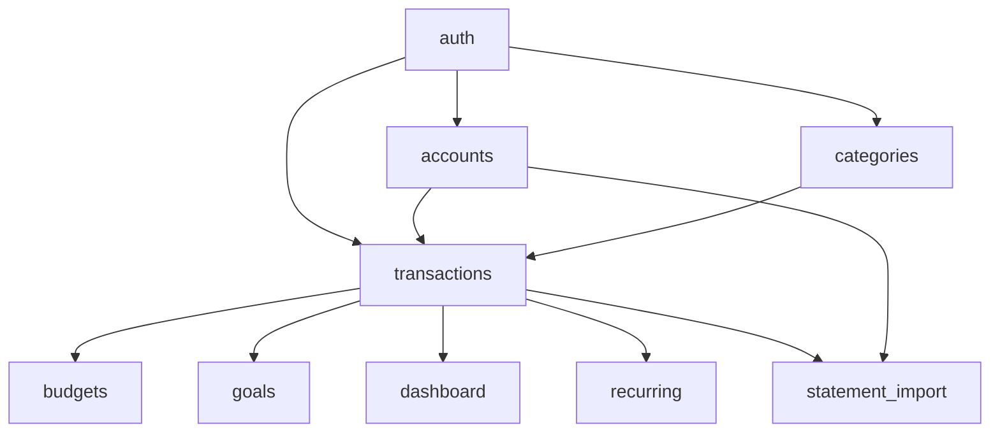

# CashTrail — Vertical Slice Architecture (FASE 9)

## 1. Funcionalidades → Slices candidatas

A partir dos RF de `03-requirements.md`:

| Funcionalidade | Slice |
|---|---|
| Registro/Login (RF-001/002) | `auth` |
| CRUD de contas (RF-003) | `accounts` |
| CRUD de categorias (RF-004) | `categories` |
| Lançamentos manuais (RF-005) | `transactions` |
| Dashboard mensal (RF-006) | `dashboard` |
| Orçamento por categoria/mês (RF-007/008) | `budgets` |
| Metas de economia (RF-009) | `goals` |
| Lançamento recorrente (RF-010) | `recurring` |
| Importação de extrato (RF-011/012) | `statement_import` |

## 2. Dependências entre slices

`transactions` é o único conceito genuinamente compartilhado entre múltiplas funcionalidades — não por acidente, mas porque lançamento é o dado central do domínio:



**Regra de dependência explícita:** a seta representa "depende de", nunca circular. `transactions` não conhece `budgets`, `goals`, `dashboard`, `recurring` nem `statement_import` — são eles que dependem de `transactions`, nunca o contrário. Isso evita que o conceito central do domínio vire acoplado às features que o consomem.

**Como uma slice depende de outra, na prática:** uma feature só pode chamar a camada `service` pública de outra feature (ex: `budgets` chama `transactions.service.sum_by_category_period(...)`). **Nunca** acessa o `repository` ou o `model` ORM de outra feature diretamente — isso preservaria o encapsulamento de persistência de cada slice mesmo quando há dependência funcional entre elas.

## 3. O que é realmente compartilhado (infraestrutura transversal, não "utils genérico")

Diferente de uma pasta `shared/`/`utils/` genérica (que a metodologia pede pra evitar), o que se repete entre *todas* as slices são responsabilidades de infraestrutura nomeadas e específicas:

- **Configuração** (variáveis de ambiente, settings)
- **Conexão com banco** (engine/session do SQLAlchemy)
- **Segurança** (hash de senha, geração/validação de JWT)
- **Autenticação como dependency** (`get_current_user`, usado por toda rota protegida)
- **Tratamento global de erros** (handlers de exceção do FastAPI)
- **Logging**

Essas responsabilidades vivem em `backend/src/core/` — não é uma "gaveta de miscelânea", é um conjunto explícito e limitado de preocupações transversais nomeadas (exatamente como a metodologia distingue infraestrutura transversal legítima de pasta genérica sem responsabilidade clara).

## 4. O que deve permanecer isolado

- Cada slice possui seu **próprio modelo ORM**, schema Pydantic, rota, regra de negócio e teste.
- `statement_import` não deve reimplementar a lógica de criação de lançamento — deve chamar `transactions.service.create_transaction(...)`, garantindo que a regra de negócio de lançamento (RB-001, validação de conta/categoria do usuário) só existe em um lugar.
- `recurring` gera lançamentos pelo mesmo caminho — nunca insere direto na tabela de `transactions`.

## 5. Estrutura inicial do repositório

```
cashtrail/
├── backend/
│   ├── src/
│   │   ├── core/                     # infraestrutura transversal (não é "utils")
│   │   │   ├── config.py             # settings (env vars)
│   │   │   ├── database.py           # engine/session SQLAlchemy
│   │   │   ├── security.py           # hash de senha, JWT
│   │   │   ├── dependencies.py       # get_current_user e afins
│   │   │   └── error_handlers.py     # tratamento global de erro
│   │   ├── features/
│   │   │   ├── auth/                 # registro, login, refresh
│   │   │   ├── accounts/             # CRUD de contas
│   │   │   ├── categories/           # CRUD de categorias
│   │   │   ├── transactions/         # lançamentos - slice central do domínio
│   │   │   ├── budgets/              # orçamento por categoria/mês
│   │   │   ├── goals/                # metas de economia
│   │   │   ├── recurring/            # lançamentos recorrentes + job APScheduler
│   │   │   ├── statement_import/     # upload/parse/conciliação CSV-OFX
│   │   │   └── dashboard/            # agregações de leitura (resumo, gráficos)
│   │   └── main.py                   # monta o app FastAPI, registra routers
│   ├── alembic/                      # migrations versionadas
│   ├── tests/
│   │   └── integration/              # testes que atravessam múltiplas slices (ex: import -> dashboard)
│   └── Dockerfile
├── frontend/
│   ├── app/                          # Next.js App Router (rotas)
│   ├── features/                     # componentes/hooks por funcionalidade (espelha o backend)
│   ├── components/ui/                # componentes gerados pelo shadcn/ui (convenção da própria lib, não "dumping ground")
│   └── lib/
│       └── api-client.ts             # cliente HTTP único + interceptação de JWT (responsabilidade transversal real, análoga ao core/ do backend)
├── docs/                              # este discovery
├── .github/workflows/                # CI
└── docker-compose.yml                 # Postgres local
```

**Papel de cada parte:**
- `core/` (backend) e `lib/` (frontend): as únicas pastas "transversais" do projeto — cada uma tem responsabilidade nomeada e limitada, não é onde qualquer coisa sem lugar óbvio é jogada.
- `features/*` (backend e frontend): cada pasta é uma fatia vertical completa da funcionalidade — schema, regra, persistência, rota (ou UI/hook, no front) e teste da própria funcionalidade moram juntos.
- Cada feature de backend expõe um `service.py` como sua "API pública" para outras slices — o resto (`repository.py`, `models.py`) é implementação interna, não deve ser importado de fora da própria pasta.

**Dentro de cada `features/<nome>/` (backend):**
```
features/transactions/
├── router.py       # rotas FastAPI
├── schemas.py       # Pydantic (request/response) - nunca expõe o model ORM direto
├── service.py        # regra de negócio + API pública pra outras slices
├── repository.py     # acesso a dado (SQLAlchemy) - uso interno da slice
├── models.py          # modelo ORM da slice
└── tests/
```

---

**STATUS**: Pronto para avançar.

Seguimos para a **FASE 10 — Modelo de Domínio e Dados** (entidades, relacionamentos, tabelas PostgreSQL)?
