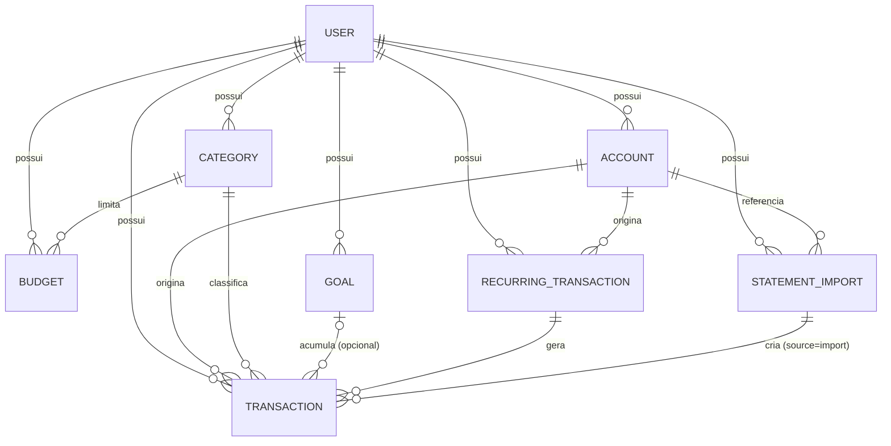

# CashTrail — Modelo de Domínio e Dados (FASE 10)

## Entidades e atributos

### User (slice `auth`)
- `id` (PK), `email` (único), `password_hash`, `created_at`
- Dado sensível: `password_hash` — nunca exposto em nenhum schema de resposta.

### Account — conta (slice `accounts`)
- `id` (PK), `user_id` (FK), `name`, `type` (`checking` | `savings` | `credit_card`), `is_archived` (bool), `created_at`
- **RB-003 (FASE 4)**: conta arquivada não aceita novos lançamentos, mas mantém histórico.

### Category — categoria (slice `categories`)
- `id` (PK), `user_id` (FK), `name`, `is_archived` (bool)
- **RB-005 (FASE 3)**: categoria com lançamentos associados não pode ser excluída, só arquivada.

### Transaction — lançamento (slice `transactions`, entidade central)
- `id` (PK), `user_id` (FK), `account_id` (FK), `category_id` (FK), `goal_id` (FK, nullable), `type` (`income` | `expense`), `amount` (decimal, sempre positivo — o sinal vem do `type`, não do valor, decisão da FASE 4 para evitar ambiguidade), `description`, `occurred_at` (data do lançamento), `source` (`manual` | `recurring` | `import`), `import_fitid` (nullable, só preenchido quando `source = import` e veio de OFX — chave de deduplicação da FASE 4), `recurring_transaction_id` (FK, nullable, se `source = recurring`), `created_at`
- **RB-001**: pertence a exatamente uma conta e uma categoria.
- **Invariante**: `amount > 0` sempre; direção do fluxo vem exclusivamente de `type`.

### Budget — orçamento (slice `budgets`)
- `id` (PK), `user_id` (FK), `category_id` (FK), `month` (ano-mês), `limit_amount` (decimal)
- **RB-002**: unique constraint em (`user_id`, `category_id`, `month`).

### Goal — meta de economia (slice `goals`)
- `id` (PK), `user_id` (FK), `name`, `target_amount` (decimal), `target_date` (nullable), `is_achieved` (bool), `created_at`
- **RB-003 (FASE 4)**: progresso = soma de `Transaction.amount` onde `Transaction.goal_id = Goal.id` (não é campo persistido, é calculado — evita inconsistência entre valor guardado e soma real).

### RecurringTransaction — lançamento recorrente (slice `recurring`)
- `id` (PK), `user_id` (FK), `account_id` (FK), `category_id` (FK), `type`, `amount`, `description`, `frequency` (`monthly` | `weekly`, etc.), `next_occurrence_date`, `is_active` (bool), `created_at`
- **RB-004**: continua gerando `Transaction` (com `source=recurring`) até `is_active=false`.

### StatementImport — importação de extrato (slice `statement_import`)
- `id` (PK), `user_id` (FK), `account_id` (FK), `file_name`, `file_format` (`csv` | `ofx`), `status` (`processing` | `completed` | `failed`), `transactions_created` (int), `transactions_flagged` (int, possíveis duplicatas pendentes de revisão), `created_at`
- Serve de registro de auditoria de cada importação — não é estritamente exigido pelas RF, mas é barato de manter e resolve a exigência implícita de "resumo da importação" do Fluxo 6 (`04-usecases.md`).

## Diagrama entidade-relacionamento

## Índices e constraints recomendados

| Tabela | Constraint/índice | Motivo |
|---|---|---|
| `users` | unique(`email`) | RF-001 |
| `accounts`, `categories`, `budgets`, `goals`, `recurring_transactions` | índice em `user_id` | toda query filtra por usuário (RNF-001) — índice evita full scan |
| `budgets` | unique(`user_id`, `category_id`, `month`) | RB-002 |
| `transactions` | índice em (`user_id`, `occurred_at`) | consultas de dashboard/relatório por período são o acesso mais frequente |
| `transactions` | índice único em (`account_id`, `import_fitid`) **onde `import_fitid` não é nulo** | deduplicação OFX (Fluxo 6, FASE 4) — banco garante a regra, não só a aplicação |
| `transactions.account_id`, `.category_id`, `.goal_id`, `.recurring_transaction_id` | FK com `ON DELETE RESTRICT` (contas/categorias) e `ON DELETE SET NULL` (goal/recurring) | impede exclusão de conta/categoria com histórico (RB-005/análogo para conta); perder o vínculo com meta/recorrência não deve apagar o lançamento em si |

## Dados sensíveis, auditáveis e retenção

- **Sensível**: `password_hash` (nunca exposto), arquivos de extrato brutos no Blob Storage (dados bancários — tratar como sensível mesmo sendo só CSV/OFX, ver FASE 11).
- **Auditável**: `StatementImport` já funciona como trilha de auditoria de importações. Não vejo necessidade de um log de auditoria genérico adicional no MVP — seria complexidade sem uso concreto ainda.
- **Exclusão/soft delete**: contas e categorias usam `is_archived` (soft delete) porque têm histórico dependente (RB-005 e análogo). Lançamentos, orçamentos e metas **não** precisam de soft delete — não há razão de negócio para "arquivar" um lançamento incorreto; exclusão definitiva é aceitável ali (com o registro ficando no `StatementImport.transactions_created` como contagem histórica, não como referência viva).

## Migrations

- Alembic, uma migration por mudança de schema, versionada no repositório. Sem estratégia adicional necessária além disso — mudanças de schema em produção afetam uma única usuária, não exigem plano de migração de dados em zero-downtime.

---

**STATUS**: Pronto para avançar.

**PENDÊNCIA leve**: a estratégia de índice único para `import_fitid` pressupõe que o Postgres suporte índice único parcial (`WHERE import_fitid IS NOT NULL`) — isso é um recurso padrão do PostgreSQL, não precisa de validação extra.

Seguimos para a **FASE 11 — Segurança (Threat Model)**?
