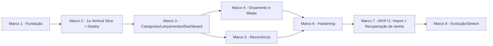

# CashTrail — Roadmap (FASE 13)

## Princípio orientador

A metodologia pede que a **primeira Vertical Slice** vá até produção antes de replicar o padrão pras fatias maiores (seção 25) — isso evita descobrir um problema estrutural (ex: SPIKE do frontend falhar, cold start inaceitável, CORS/cookie não funcionar entre domínios Azure) só depois de já termos construído todas as 8 features do MVP. Por isso o roadmap **não** deixa deploy pro final — ele acontece cedo, com a menor fatia possível, e o resto do MVP é construído sobre uma arquitetura já provada em produção.

## Marco 1 — Fundação mínima

**Objetivo**: ter o esqueleto do projeto rodando local e em CI, sem nenhuma feature de negócio ainda.
**Entregas**: monorepo (`backend/`, `frontend/`, `docs/`), Docker Compose com Postgres local, esqueleto FastAPI com `/health`, esqueleto Next.js com shadcn/ui configurado, GitHub Actions rodando build (mesmo sem teste de negócio ainda).
**Por que agora**: nada do resto pode começar sem isso; é puramente ferramental, sem decisão de produto pendente.
**Dependências**: nenhuma — todas as decisões de stack já estão fechadas (`07-stack.md`).
**Critério de saída**: `docker-compose up` sobe Postgres + backend respondendo `/health`; `npm run dev` sobe o Next.js; CI verde.

## Marco 2 — Primeira Vertical Slice ponta a ponta (com deploy real)

**Objetivo**: provar que a arquitetura inteira funciona de verdade — não só em código, em produção.
**Escopo**: slice `auth` (registro/login) + slice `accounts` (CRUD simples), atravessando UI → API → autenticação → validação → regra de negócio → persistência → resposta → teste, **e deployado na Azure** (backend em Container Apps, Postgres Flexible Server, frontend em Static Web Apps ou Vercel conforme resultado do SPIKE).
**O que precisamos aprender aqui, antes de continuar**:
- O SPIKE do Next.js híbrido no Azure Static Web Apps (`05-integrations.md`) — se falhar, migrar frontend pra Vercel **agora**, não depois de mais 6 features construídas.
- Se o cookie `httpOnly` cross-origin (decisão de `11-security.md`) funciona de fato entre os domínios reais do frontend e backend na Azure.
- Se o cold start do Container Apps é aceitável na prática.
**Por que agora**: é a fatia mais barata possível que ainda atravessa 100% das camadas da arquitetura — o lugar certo pra essas 3 incertezas técnicas explodirem, se forem explodir.
**Dependências**: Marco 1.
**Desbloqueia**: todo o resto do MVP replica este mesmo padrão (estrutura de slice, autenticação, deploy) sem re-descobrir nada.
**Critério de saída**: usuária real consegue se registrar, logar e criar uma conta bancária, tudo isso rodando na URL pública da Azure, com teste automatizado cobrindo o fluxo.

## Marco 3 — Núcleo do MVP: categorias, lançamentos e dashboard

**Escopo**: slices `categories`, `transactions`, `dashboard`.
**Por que agora**: `transactions` é a entidade central do domínio (`09-vertical-slices.md`) — tudo que vem depois (orçamento, metas, recorrência) depende dela existir e estar testada.
**Dependências**: Marco 2 (padrão de slice e deploy já validado).
**Critério de saída**: lançamento criado reflete no dashboard imediatamente; soma do dashboard bate com conferência manual (critério já definido no plano original).

## Marco 4 — Orçamento e Metas

**Escopo**: slices `budgets`, `goals`.
**Por que agora**: ambas dependem só de `transactions` (Marco 3), não uma da outra — podem ser feitas em qualquer ordem ou em paralelo se fizer sentido pra você.
**Dependências**: Marco 3.
**Critério de saída**: orçamento mostra % consumido em tempo real; meta mostra progresso vinculado a lançamentos (RB-003).

## Marco 5 — Lançamentos recorrentes

**Escopo**: slice `recurring` (inclui o job APScheduler).
**Por que agora**: também depende só de `transactions`; feita depois de Orçamento/Metas só porque é a última dor das 4 confirmadas na FASE 1 a ser resolvida — ordem não é tecnicamente obrigatória, é só a sequência que ficou natural dado o restante.
**Dependências**: Marco 3.
**Critério de saída**: lançamento recorrente configurado gera automaticamente a próxima ocorrência sem ação manual.

## Marco 6 — Hardening do MVP

**Escopo**: cobertura de teste revisada nos fluxos críticos, aplicação do checklist de segurança (`11-security.md`), automação de start/stop do banco (`06-costs.md`), README final com arquitetura/decisões/link de demo.
**Por que agora**: só faz sentido "endurecer" depois que todas as 8 funcionalidades obrigatórias do MVP (`12-mvp.md`) existem — evita retrabalho de revisar segurança/teste de uma feature que ainda vai mudar.
**Dependências**: Marcos 3, 4 e 5 completos.
**Critério de saída**: MVP atende aos critérios de aceitação definidos em `12-mvp.md`.

**→ Fim do MVP.**

## Marco 7 — MVP+1

**Escopo**: RF-011/012 (importação CSV/OFX com conciliação) + RF-013 (recuperação de senha via Azure Communication Services Email).
**Por que depois do MVP e não dentro dele**: decisão já registrada em `12-mvp.md` — nenhuma das duas bloqueia provar o ciclo central de controle financeiro.
**Dependências**: MVP completo (Marco 6) — importação precisa de `transactions` e `accounts` maduros; recuperação de senha precisa da infraestrutura de auth madura.
**Critério de saída**: reimportar o mesmo arquivo não duplica lançamentos (RF-012); fluxo de "esqueci minha senha" funciona ponta a ponta.

## Marco 8 — Evolução / Stretch (não comprometido, avaliar quando chegar lá)

- Terraform para a infraestrutura Azure (prova extra de skill de IaC).
- Observabilidade mais completa (Application Insights ou similar) — deliberadamente adiada em `08-architecture.md`.
- MFA — deliberadamente fora do MVP em `11-security.md`.
- Integração bancária real (Open Finance) — **tratar como muito improvável de acontecer**, dado o custo de R$2.500-6.000/mês levantado em `02-market-research.md`; mantido na lista só porque o modelo de dados já não fecha essa porta, não porque haja plano concreto de fazer.

## Diagrama de dependências

---

**STATUS**: Pronto para avançar.

Seguimos para a **FASE 14 — Estimativa de Esforço e Tempo** (por marco, em intervalos, com premissas e riscos explícitos)?
